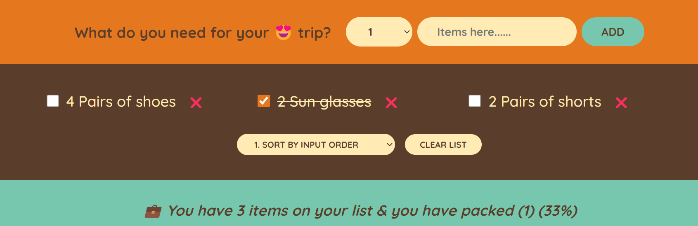

# FAR AWAY

"FAR AWAY" is a comprehensive item listing application designed specifically for travelers. This application aims to streamline the packing process, ensuring that travelers are well-prepared for their journeys, whether they are embarking on a short weekend getaway or an extended international adventure. Here’s an in-depth look at the features and functionalities of the "FAR AWAY" application:

### Key Features

#### 1. **Personalized Packing Lists**

- **Customizable Templates**: Users can start with pre-made packing templates tailored to different types of trips (beach vacation, business trip, hiking adventure, etc.) and customize them to fit their needs.
- **Smart Suggestions**: Based on the trip details such as destination, duration, and activities planned, the app suggests items that might be necessary. For example, it will recommend sunscreen for a tropical destination or a power adapter for international travel.

#### 2. **Trip Planning Integration**

- **Itinerary Syncing**: Users can integrate their travel itineraries, allowing the app to make more precise packing recommendations. This includes syncing with popular travel planning apps and calendars.
- **Weather Updates**: Real-time weather updates for the destination help users pack appropriately for the conditions they will encounter.

#### 3. **Category Organization**

- **Categorized Items**: Items are grouped into categories like clothing, toiletries, electronics, documents, and miscellaneous, making it easier to organize and find what you need.
- **Subcategories and Tags**: Users can create subcategories and tag items for more detailed organization (e.g., "electronics" can have subcategories like "chargers," "cameras," etc.).

#### 4. **Collaboration and Sharing**

- **Shared Packing Lists**: Travelers can share their packing lists with companions to ensure nothing is forgotten and to avoid duplicate items.
- **Collaborative Editing**: Multiple users can collaboratively edit a single list, making it perfect for group trips.

#### 5. **Checklists and Reminders**

- **Interactive Checklists**: Users can check off items as they pack them, ensuring nothing is left behind.
- **Reminder Alerts**: Set reminders for last-minute items that need to be packed just before leaving, like toiletries or chargers.

#### 6. **Inventory Management**

- **Home Inventory**: Keep track of items that are commonly packed for trips and their locations at home, making it easy to find and pack them.
- **Usage History**: Track which items were used or not used during previous trips to refine future packing lists.

#### 7. **Visual Aids**

- **Photos and Notes**: Attach photos and notes to items for quick identification and additional packing instructions.
- **Weight and Volume Estimation**: Calculate the total weight and volume of packed items to avoid exceeding luggage limits.

#### 8. **Language and Currency Support**

- **Multi-Language Support**: The app supports multiple languages, catering to a global user base.
- **Currency Conversion**: Integrated currency converter for managing travel budgets and expenses.

### User Experience

#### Intuitive Interface

- **User-Friendly Design**: A clean, intuitive interface that makes navigation simple, even for less tech-savvy users.
- **Drag and Drop**: Easily organize and rearrange items using drag-and-drop functionality.

#### Offline Accessibility

- **Offline Mode**: Access and edit packing lists without an internet connection, ensuring users can use the app even in remote areas.

### Additional Features

- **Sustainability Tips**: Suggestions for eco-friendly packing, such as reusable items and minimalistic packing strategies.
- **Emergency Contacts and Info**: Store important information like emergency contacts, travel insurance details, and copies of travel documents.

### Target Audience

"FAR AWAY" is ideal for:

- Frequent travelers who need efficient and organized packing solutions.
- Families and groups who travel together and require collaborative packing lists.
- Solo travelers looking for personalized packing suggestions.
- Adventure enthusiasts who need specialized gear and equipment.

### Conclusion

"FAR AWAY" aims to be the ultimate travel companion for all your packing needs, reducing the stress of travel preparation and ensuring that you have everything you need for a smooth and enjoyable trip.
